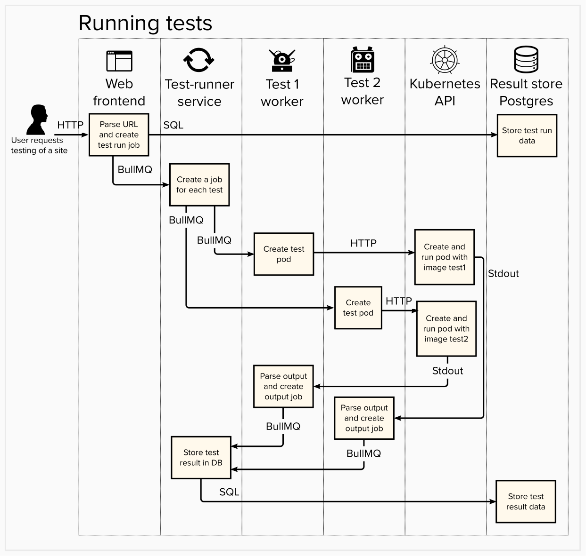
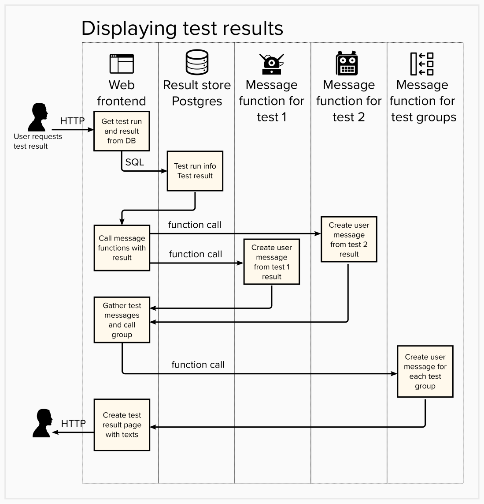

# Architecture for Robust tjänst

# Design goals

## Ease of developing tests

High quality tests (of the right things) are a requirement for the platform to be successful. To get those we need to make it easy to write and maintain tests. As the tests are Docker images developers are free to use the tools and languages most appropriate or familiar.

Test output is a JSON string returned on standard output, e.g. with `print`, `echo` or `console.log`. For simpler tests the output can be created manually, without special JSON tools. For details of output format see test [README](/packages/tests/tests/README.md).

## Ease of writing test messages

A good test also requires a good description of the test and its result, be it pass or fail. This description must inform the user of what the test did, what went right and what went wrong. It is therefore strongly tied to the test implementation.

We store keep code that generates test descriptions (we call them `message functions`) side by side with the tests to they can be maintained together. By allowing the message functions to generate [Markdown](https://www.markdownguide.org) test results can be shown with formatting such as tables, lists and headlines, using whatever is best for the specific test.

## Security and stability

We will be making requests to any site requested and parsing whatever we get back. This exposes a large attack surface, and there certainly is a risk that a test might crash, get stuck in a loop or in worst case be vulnerable to code injection.

By running the tests in separate pods in a separate Kubernetes namespace we can give them a short time to live, restrict the resources they can consume and crashes are contained and cleaned up. Kubernetes is a powerful tool for managing processes and gives us much for free.

# Components

## Web frontend /web
Allows users to request test runs and displays test results with `/web/src/tests.js`. Communicates with test-runner using BullMQ.

## Test runner /tests/runner.js
Processes test-run-jobs, calls test-workers and receives output from test workers, all using BullMQ. Uses `tests/index.js` to know which tests exist.

## Test workers /tests/testWorker.js
Instantiated by the test-runner.

Processes test-worker jobs, uses the Kubernets API to create test pods and get the output of the test pods. Parses test pod output and sends it to the test-runner using BullMQ.

## Tests /tests/tests/
Consist of:

* The test code, in any language.
* `Dockerfile` detailing how to build the test image.
* `messages.js` which exports a function that takes what the test outputs and returns a JSON object with descriptions of the result.

For more details see the test [README](/packages/tests/tests/README.md)

## Group Messages /tests/groupMessages.js
Every test belongs to a group as specified in `tests/index.js`. This file has a descriptions of the groups and the messages shown when the tests in the group pass or fail.

## PostgreSQL database
Stores test runs and test results.

## Redis database
Used by BullMQ.

# Flowcharts

